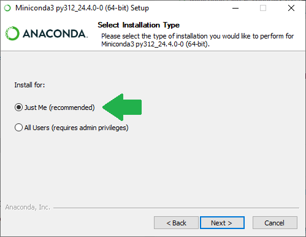
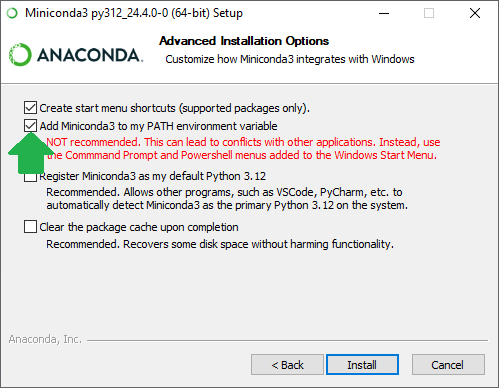

# Setting up your computer

This chapter provides instructions for setting up your computer.

## Computer hardware

To execute the notebooks in this collection, it is highly recommended to use a computer with a CUDA compatible NVidia Graphics card with at least 4GB of memory. These notebooks were tests on a Windows 10 Laptop with an NVidia RTX 3050 Mobile GPU.

## Setting up Python and Conda environments

When working with Python, we will make use of many plugins and software libraries which need to be organized.
One way of doing this, is by managing *Conda* environments.
A conda environment can be seen as a virtual desktop, or virtual computer, accessible via the terminal. 
If you install some software into one Conda environment, it may not be accessible from another environment. 
If a Conda environment breaks, e.g. incompatible software was installed, you can just make a new one and start over.

See also
* [Managing Scientific Python environments using Conda, Mamba and friends](https://focalplane.biologists.com/2022/12/08/managing-scientific-python-environments-using-conda-mamba-and-friends/)
* [Scientific Data Analysis with Python](https://youtu.be/MOEPe9TGBK0)
* [Getting started with Mambaforge and Python](https://biapol.github.io/blog/mara_lampert/getting_started_with_mambaforge_and_python/readme.html)

## Install Mini-conda
Download and install mamba/conda. We recommend the distribution [mini-conda](https://docs.anaconda.com/miniconda/). If you already have an old Anaconda installation you haven't touched for a while, it is highly recommended to uninstall it and install mini-conda instead.

For ease-of-use, it is recommended to install it for your use only and to add Conda to the PATH variable during installation.





## Setting up a conda environment

You can create a conda environment using this command from the terminal:

```
conda create --name genai2 python=3.11 jupyterlab pytorch torchvision torchaudio pytorch-cuda=11.8 cudatoolkit=11.8 huggingface_hub diffusers transformers accelerate anthropic openai langchain stackview voila pandas torchmetrics scikit-learn seaborn -c pytorch -c nvidia -c conda-forge
```

Activate the environment:
```
conda activate genai2
```

Install some additional packaged via pip:
```
pip install python-pptx bia-bob blablado llama-index
```

The used conda environment is also available for download as [environment.yml](environment.yml) file.

## Installing ollama

To make use of the ollama-based models, please install [ollama](https://ollama.com/download). The notebooks in this folder were tested with ollama version 0.1.39

Furthermore, consider downloading these models:

[llava 1.6](https://ollama.com/library/llava), [mistral:v0.3](https://ollama.com/library/mistral:v0.3) and
[gemma](https://ollama.com/library/gemma)
```
ollama run llava
ollama run mistral:v0.3
ollama run gemma
```

Note: You can print out which models you have downloaded like this:
```
ollama list
```

## Setting up API keys

If you plan to use the commercial language models, you need to register at their websites and acquire so called API keys. You do not need to get these keys for all exercises, but for some they might be useful.
* [OpenAI (gpt)](https://openai.com/blog/openai-api)
* [Anthropic (claude)](https://www.anthropic.com/api)

If you are German academic, you may also be eligible to acquire a free API key from Helmholtz.AI for the blablador infrastructure:
* (blablador[https://sdlaml.pages.jsc.fz-juelich.de/ai/guides/blablador_api_access/]

You can then save these keys in the environment variables of your computer as explained [on this page](https://help.openai.com/en/articles/5112595-best-practices-for-api-key-safety).


